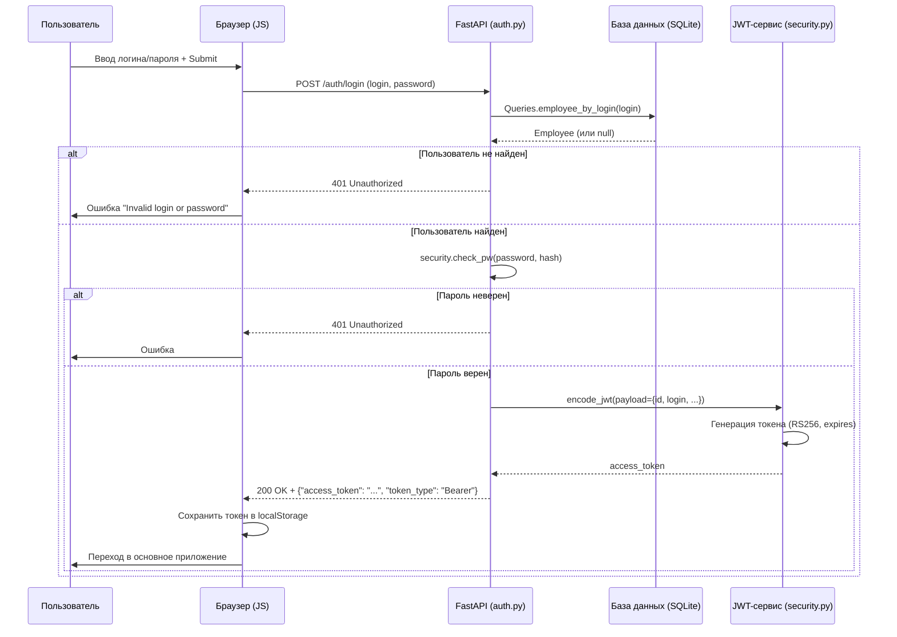

## Диаграмма аутентификации (логин)

```mermaid
sequenceDiagram
    participant User as Пользователь
    participant Browser as Браузер (JS)
    participant API as FastAPI (auth.py)
    participant DB as База данных (SQLite)
    participant JWT as JWT-сервис (security.py)

    User->>Browser: Ввод логина/пароля + Submit
    Browser->>API: POST /auth/login (login, password)

    API->>DB: Queries.employee_by_login(login)
    DB-->>API: Employee (или null)

    alt Пользователь не найден
        API-->>Browser: 401 Unauthorized
        Browser->>User: Ошибка "Invalid login or password"
    else Пользователь найден
        API->>API: security.check_pw(password, hash)
        alt Пароль неверен
            API-->>Browser: 401 Unauthorized
            Browser->>User: Ошибка
        else Пароль верен
            API->>JWT: encode_jwt(payload={id, login, ...})
            JWT->>JWT: Генерация токена (RS256, expires)
            JWT-->>API: access_token
            API-->>Browser: 200 OK + {"access_token": "...", "token_type": "Bearer"}
            Browser->>Browser: Сохранить токен в localStorage
            Browser->>User: Переход в основное приложение
        end
    end
```
